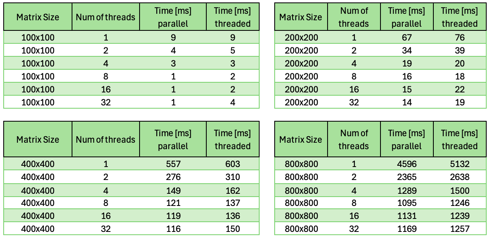
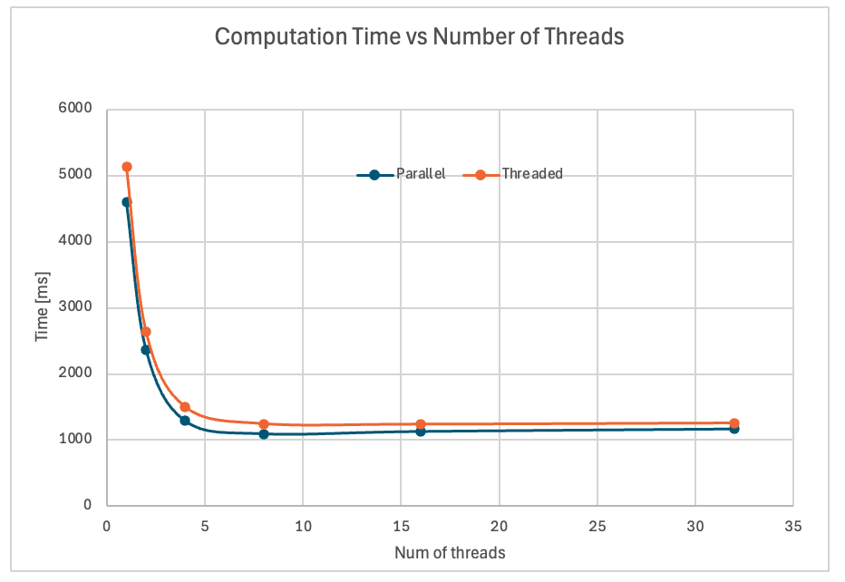

# MatrixApp

**MatrixApp** to aplikacja konsolowa napisana w C#, która wykonuje operacje na macierzach, w tym mnożenie macierzy przy użyciu różnych technik wielowątkowości (równoległe oraz przy użyciu własnych wątków). Program oferuje również możliwość przeprowadzenia testu wydajnościowego (benchmarku) dla różnych rozmiarów macierzy i liczby wątków.

## Spis treści

- [Funkcjonalności](#funkcjonalności)
- [Technologie](#technologie)
- [Instalacja i uruchomienie](#instalacja-i-uruchomienie)
- [Przykład użycia](#przykład-użycia)
- [Opis działania](#opis-działania)
- [Benchmark](#benchmark)
- [Model danych](#model-danych)
- [Uwaga dot. wielkości macierzy](#uwaga-dot-wielkości-macierzy)
- [Licencja](#licencja)

## Funkcjonalności

- Mnożenie macierzy z wykorzystaniem różnych metod wielowątkowych:
  - Równoległe przetwarzanie (`Parallel.For`)
  - Przetwarzanie przy pomocy własnych wątków (`Thread`)
- Możliwość uruchomienia benchmarku porównującego czas wykonania dla różnych liczby wątków oraz rozmiarów macierzy
- Zapis wyników benchmarku do pliku CSV
- Obsługuje dowolne rozmiary macierzy oraz liczbę wątków

## Technologie

- C#
- .NET
- Wątki i równoległość (`Thread`, `Parallel.For`)
- Operacje na macierzach
- StreamWriter do zapisu wyników do pliku CSV

## Instalacja i uruchomienie

1. **Sklonuj repozytorium:**

```bash
git clone https://github.com/twoj-login/matrixapp.git
cd matrixapp
```

2. **Zainstaluj zależności (jeśli są wymagane):**

Aplikacja nie wymaga zewnętrznych zależności, działa na standardowej bibliotece .NET.

3. **Uruchom aplikację:**

```bash
dotnet run -- <threads_num> <size> [benchmark]
```

Gdzie:
- `<threads_num>`: liczba wątków do użycia (np. 4)
- `<size>`: rozmiar macierzy (np. 500 dla 500x500)
- `[benchmark]`: opcjonalnie, jeśli chcesz uruchomić benchmark (porównanie czasów różnych metod)

## Przykład użycia

### Uruchomienie testu mnożenia macierzy:

```bash
dotnet run -- 4 500
```

Powyższe polecenie wykonuje mnożenie dwóch macierzy o rozmiarze 500x500 z użyciem 4 wątków.

### Uruchomienie benchmarku:

```bash
dotnet run -- 4 500 benchmark
```

Powyższe polecenie uruchamia benchmark, który porównuje czasy wykonania dla różnych liczby wątków (1, 2, 4, 8, 16, 32) oraz różnych rozmiarów macierzy (100x100, 200x200, 400x400, 800x800).

## Opis działania

Program wykonuje operację mnożenia dwóch macierzy, a wynik jest obliczany na dwa sposoby:

1. **Mnożenie przy użyciu `Parallel.For`:**
   - Równoległe przetwarzanie — każda linia macierzy jest przetwarzana w oddzielnym wątku.
   - Szybsze dla większych macierzy i większej liczby wątków.

2. **Mnożenie przy użyciu własnych wątków (`Thread`):**
   - Każdy wątek obsługuje część macierzy (np. podział na wiersze).
   - Również umożliwia wielowątkowość, ale jest mniej optymalny w porównaniu do metody `Parallel.For`.

Obie metody zostały zaimplementowane w klasie `Matrix`, która zawiera następujące operacje:
- `GenerateRandom(int rows, int cols)`: Generuje losową macierz o podanym rozmiarze.
- `MultiplyParallel(Matrix A, Matrix B, int maxThreads)`: Mnożenie macierzy przy użyciu `Parallel.For`.
- `MultiplyThreaded(Matrix A, Matrix B, int threadCount)`: Mnożenie macierzy przy użyciu własnych wątków.

## Benchmark

Aby uruchomić benchmark, należy użyć opcji `benchmark` podczas uruchamiania aplikacji. Program wykona mnożenie macierzy dla różnych rozmiarów i liczby wątków, a następnie zapisze wyniki w pliku CSV w formacie:

```csv
MatrixSize;Threads;AverageTimeMsParallel;AverageTimeMsThread
100x100;1;15;20
100x100;2;10;15
...
```

Wyniki są zapisywane w pliku `benchmark_results.csv`.

## Wyniki benchmarku

Tabela wyników benchmarku:



## Wykres porównujący czas wykonania w zależności od liczby wątków

Wykres przedstawia czas wykonania operacji dla różnych liczby wątków:



## Wnioski 


1. **Czas obliczeń i liczba wątków**:
   - Z danych oraz wykresu wynika, że czas obliczeń maleje wraz ze wzrostem liczby wątków, szczególnie przy przejściu z 1 wątku na kilka wątków. Dla mniejszych macierzy (takich jak 100x100, 200x200) spadek czasu obliczeń jest bardziej zauważalny, natomiast dla większych macierzy (np. 800x800) spadek staje się mniej wyraźny po osiągnięciu pewnej liczby wątków (np. 8 wątków).
   
   - **Dla macierzy 800x800**:
     - **1 wątek**: Czas obliczeń jest znacznie wyższy (około 4596 ms dla Parallel i 5132 ms dla Thread).
     - **Zwiększanie liczby wątków**: Zwiększanie liczby wątków prowadzi do znacznego skrócenia czasu (np. przy 2 wątkach czas spada do 2365 ms dla Parallel i 2638 ms dla Thread).
     

2. **Podejście równoległe vs. wątkowe**:
   - **Dla mniejszych macierzy (100x100, 200x200)**: Podejście równoległe (Parallel) daje lepsze wyniki niż podejście wątkowe (Thread), co sugeruje, że użycie `Parallel.For` lepiej rozdziela obciążenie między rdzenie CPU, co prowadzi do szybszego wykonania.
   - **Dla większych macierzy (800x800)**: Różnice w czasie obliczeń między podejściem równoległym a wątkowym stają się mniejsze. Może to wynikać z ograniczeń sprzętowych, takich jak liczba dostępnych rdzeni CPU. W przypadku dużych macierzy obie metody osiągają podobną wydajność.

3. **Ograniczenia systemowe i sprzętowe**:
   - **Skalowanie**: Wraz ze wzrostem rozmiaru macierzy czas obliczeń na pojedynczym elemencie macierzy rośnie. Jest to naturalne, ponieważ liczba operacji (mnożenie i dodawanie) wzrasta wraz z rozmiarem macierzy.
   - **Zmniejszająca się korzyść z większej liczby wątków**: Przy większych rozmiarach macierzy korzyść z zastosowania większej liczby wątków maleje. Jest to spowodowane ograniczeniami systemu, jak liczba dostępnych rdzeni CPU, które mogą obsługiwać wątki. Zwiększanie liczby wątków poza określoną liczbę przestaje prowadzić do znaczących popraw wydajności.


4. **Rekomendacje do optymalizacji**:
   - **Optymalna liczba wątków**: Dla mniejszych macierzy (do 200x200) warto używać większej liczby wątków (np. 16 lub 32), ponieważ daje to zauważalne przyspieszenie. Dla większych macierzy (np. 800x800) optymalna liczba wątków powinna być oparta na liczbie dostępnych rdzeni CPU. Dodawanie więcej wątków niż fizyczna liczba rdzeni nie prowadzi do dalszego przyspieszenia i może wprowadzać dodatkowe opóźnienia związane z przełączaniem kontekstu między wątkami.
  


> Autor: [Aleksander Łyskawa]
